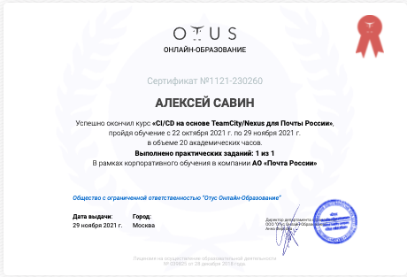
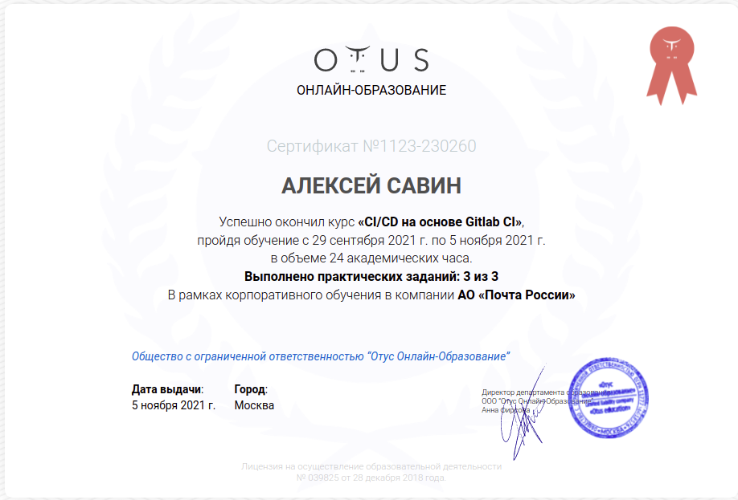

# my stats

# my favorites

# my certificates
## otus: devops

<h2>udemy</h2>
<h2>sololearn</h2>
<!-- c# -->

<!-- ds -->

<!-- python for finance -->
<a href='https://www.sololearn.com/Certificate/1139-4956289/jpg/'></a
<!-- python for data science -->

<!-- sql -->

<!-- intermediate python -->

<!-- html -->

<!-- python core -->

<!-- react and redux -->

<!-- js -->

<!-- ruby -->

<!-- jquey -->

 
<a href='https://www.sololearn.com/profile/4956289'>and more...</a>

<h2>programming hub</h2>
<h1>top images</h1>

